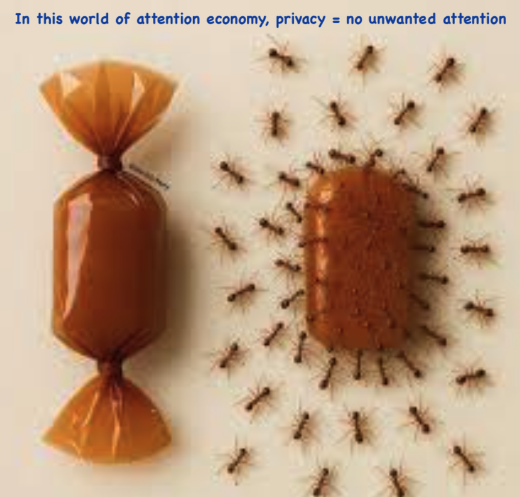

##  👋 Building stuff worth writing...
#### ...writing stuff worth reading. ✍️

>> Docs-as-code | Technical Writing | Technical Marketing

## Tech Stack (Writing, Marketing)

|  Tooling   | Deliverables | Portfolio |
| :--- | :--- | :--- |
| Markdown, Python, Mkdocs, Docusaurus, Mintlify, GitBook, Sandpack, Codesandbox, Chatbase AI | Developer Docs, APIs | [Arcana Network](https://docs.arcana.network) |
| Netlify | Self hosted docs | [Arcana Network]() |
| Notion | Technical Whitepaper | [Chain Abstraction](https://arcananetwork.notion.site/Chain-Abstraction-Technical-Paper-121f11ed0804808da2e5cdd1432b2b61)|
| Hugo | Website content: Ecosystem Tabs (*below 'Try Numpy' section*) | [Numpy.org](https://numpy.org) |
| Hugo | Case Studies | [Numpy.org](https://github.com/numpy/numpy.org/commit/b01153b19e356186df52dc193d44e864921499b2) |
| Restructured Text, Python, Sphinx, ReadTheDocs | User Docs | [GenPipes](https://genpipes.readthedocs.io/) |
| Medium, Markdown | Blog Post | [EIP-7702](https://medium.com/@shaloo.shalini/eip-7702-t5tymk-tdiitd-4168a8352836) |
| Google Analytics | Reports | *On request* |
| GitHub, Cursor, Grammarly, Vale | Doc Automation | *On Request* |
| Wordpress | Thought Leadership in Cloud Series | [Blog posts](https://www.sramanamitra.com/2010/07/28/shaloo-shalini/) |

## Thinking About

<!--
**shaloo/shaloo** is a ✨ _special_ ✨ repository because its `README.md` (this file) appears on your GitHub profile.

Here are some ideas to get you started:

- 🔭 I’m currently working on ...
- 🌱 I’m currently learning ...
- 👯 I’m looking to collaborate on ...
- 🤔 I’m looking for help with ...
- 💬 Ask me about ...
- 📫 How to reach me: ...
- 😄 Pronouns: ...
- ⚡ Fun fact: ...
-->
